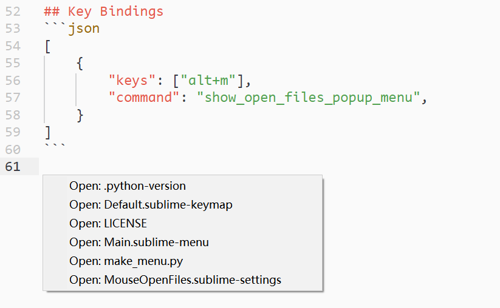

# QuickOpenFile

## Feature
Dynamically generate context menus for you, allowing you to open other files in the current directory with the right mouse button.


## Installation
This plugin depends on the [dctxmenu](https://github.com/absop/dctxmenu) plugin. Before installing this plugin, you must install `dctxmenu` plugin.

The following steps assume that you already have [Package Control](https://packagecontrol.io/) installed.

1. Copy the URL of this repository: <https://github.com/absop/QuickOpenFile>
2. Enter into Sublime Text, press down the shortcut <kbd>Ctrl+Shift+P</kbd> to enter into **Command Palette**
3. Input the command `pcar(Package Control: Add Repository)`
4. Press down the shortcut <kbd>Ctrl+V</kbd>, then <kbd>Enter</kbd>
5. Using **Package Control** to install this package
   1. Press down <kbd>Ctrl+Shift+P</kbd>
   2. Input `pcip(Package Control: Install Package)`
   3. Input `QuickOpenFile`


## Examples
If you mainly use **English**
```json
{
    "caption": "Quick Open File"
}
```


Or **Chinese**
```json
{
    "caption": "打开其他文件"
}
```


## Key Bindings

Quick open files with popup menu.

```json
[
    {
        "keys": ["alt+m"],
        "command": "show_open_files_popup_menu",
    }
]
```

