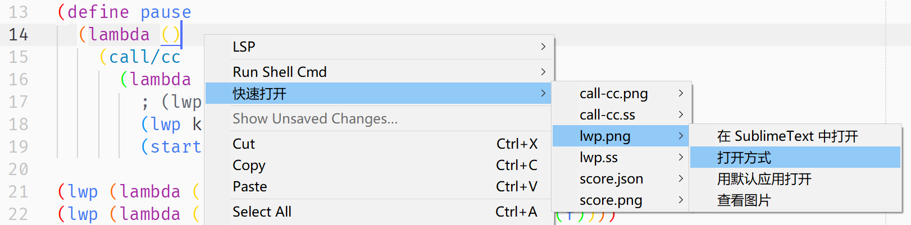

# Open Other Files

## Feature
Dynamically generate context menus for you, allowing you to open other files in the current directory with the right mouse button.


## Installation
Before you install this plugin, you need to install my another plugin [dctxmenu](https://github.com/absop/dctxmenu)(**Dynamic Context Menu**). Because this plugin(**OpenOtherFiles**) uses **dctxmenu** to generate menus dynamically.

### !! Note:
Please make sure that **dtcxmenu** is installed correctly in a subdirectory called **dtcxmenu** in your package directory. If you're using `git clone`, you won't have this problem, but if you're using a browser to download it, you'll need to change the folder name.

The following steps assume that you already have [Package Control](https://packagecontrol.io/) installed.

### Installation Steps
1. Copy the URL of this repository: <https://github.com/absop/OpenOtherFiles>
2. Enter into Sublime Text, press down the shortcut <kbd>Ctrl+Shift+P</kbd> to enter into **Command Palette**
3. Input the command `pcar(Package Control: Add Repository)`
4. Press down the shortcut <kbd>Ctrl+V</kbd>, then <kbd>Enter</kbd>
5. Using **Package Control** to install this package
   1. Press down <kbd>Ctrl+Shift+P</kbd>
   2. Input `pcip(Package Control: Install Package)`
   3. Input `OpenOtherFiles`


## Settings

There is one and only one custom entry, named `caption`, which is a **title case** string shown on context menu.


## Examples
If you mainly use **English**
```json
{
    "caption": "Open Other Files"
}
```


Or **Chinese**
```json
{
    "caption": "打开其他文件"
}
```

