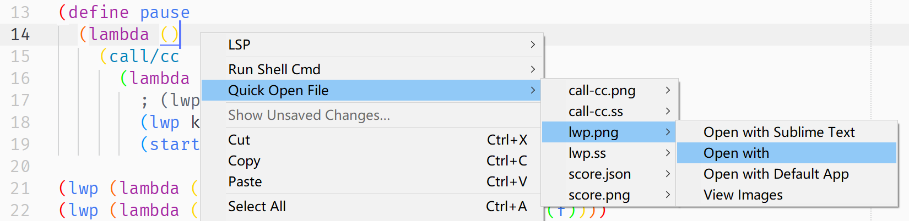

# QuickOpenFile

## Feature
Dynamically generate context menus for you, allowing you to open other files in the current directory with the right mouse button.



## Installation
This plugin depends on the [dctxmenu](https://github.com/absop/dctxmenu) plugin. Before installing this plugin, you must install `dctxmenu` plugin.

The following steps assume that you already have [Package Control](https://packagecontrol.io/) installed.

1. Copy the URL of this repository: <https://github.com/absop/QuickOpenFile>
2. Enter into Sublime Text, press down the shortcut <kbd>Ctrl+Shift+P</kbd> to enter into **Command Palette**
3. Input the command `pcar(Package Control: Add Repository)`
4. Press down the shortcut <kbd>Ctrl+V</kbd>, then <kbd>Enter</kbd>
5. Using **Package Control** to install this package
   1. Press down <kbd>Ctrl+Shift+P</kbd>
   2. Input `pcip(Package Control: Install Package)`
   3. Input `QuickOpenFile`


## Examples
If you mainly use **English**, with the default settings, click the right mouse button, you will get menu similar to the one shown below


Or **Chinese**, with the following settings
```json
{
    "caption" : "快速打开文件",

    "subitems" : [
        {
            "caption" : "在Sublime Text中打开",
            "command" : "open_file",
            "args" : {"file" : "${path}"},
            "exts" : ".*"
        },
        {
            "caption" : "选择打开方式",
            "command" : "open_file_with",
            "args" : {"file" : "${path}"},
            "exts" : ".*"
        },
        {
            "caption" : "用默认应用打开",
            "command" : "open_file_with_default_application",
            "args" : {"file" : "${path}"},
            "exts" : ".*"
        },
        {
            "caption" : "查看图片",
            "command" : "open_file_with_default_application",
            "args" : {"file" : "${path}"},
            "exts" : [
                ".pdf",
                ".png",
                ".jpg",
                ".jpeg"
            ]
        }
    ]
}
```
the plugin will crate some menus like this for you


## Key Bindings

Quick open files with popup menu.

```json
[
    {
        "keys": ["alt+m"],
        "command": "open_file_popup_menu",
        "args": {
            "command": "open_file"
        }
    },
    {
        "keys": ["alt+shift+m"],
        "command": "open_file_popup_menu",
        "args": {
            "command": "open_file_with_default_application"
        }
    }
]
```
